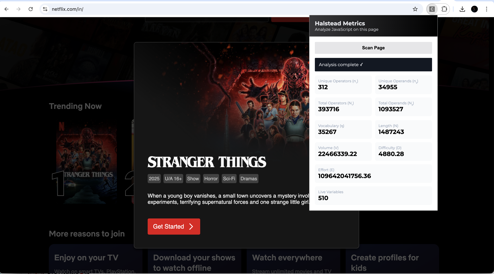

# 🧩 Code Lens | Halstead Metrics Analyzer — Chrome Extension

A lightweight Chrome extension that analyzes the **JavaScript code of any webpage** and computes **Halstead Software Metrics** — directly from your browser toolbar.  
It also estimates **Live Variables**, giving insight into runtime behavior and data usage.

Designed for **students, researchers, and developers** to quickly measure program complexity and code effort.

---

## ⭐ Features

✔ One‑click webpage code analysis  
✔ Automatically extracts inline + external JavaScript  
✔ Computes **Halstead Base Metrics**
- Unique Operators (n₁)
- Unique Operands (n₂)
- Total Operators (N₁)
- Total Operands (N₂)

✔ Computes **Halstead Derived Metrics**
- Vocabulary (η)
- Length (N)
- Volume (V)
- Difficulty (D)
- Effort (E)

✔ Computes **Live Variables**
- Estimate of variables that remain active during execution  

✔ Clean, modern popup UI  
✔ Secure & CSP‑compliant  
✔ Works offline  
✔ Montserrat font bundled locally  

---

## 📸 Screenshot

---

## 🚀 Installation (Local Development)

1. Clone or download this repository
2. Open Chrome and go to:
3. Enable **Developer Mode**
4. Click **Load unpacked**
5. Select the project folder

That’s it 🎉

The extension icon will now appear in your toolbar.

---

## 🧠 How It Works

When you click **Scan Page**:

1. A content script runs in the active tab
2. It collects:
   - Inline `<script>` blocks
   - Linked external JavaScript files
3. All code is sent to the analyzer
4. Halstead metrics & Live Variables are calculated
5. Results are shown in the popup UI

No user data is stored or transmitted.

---

## 📐 Halstead Metrics — Overview

Halstead’s theory measures software complexity using:

| Symbol | Meaning |
|--------|--------|
| n₁ | Distinct operators |
| n₂ | Distinct operands |
| N₁ | Total operators |
| N₂ | Total operands |

From these we compute:
Vocabulary (η) = n₁ + n₂
Length (N) = N₁ + N₂
Volume (V) = N * log₂(η)
Difficulty (D) = (n₁ / 2) * (N₂ / n₂)
Effort (E) = D * V

Higher values suggest higher:
- complexity
- effort to maintain
- potential defect risk

---

## 🧮 Live Variables — Overview

A **live variable** is one whose value is still needed later in execution.

This extension estimates live variables by:
- Tracking assignments
- Tracking later usage
- Counting variables that remain active

This provides insight into **state complexity**.

> Note: This is an analytical estimate — not full static analysis.

---

## 📁 Project Structure

halstead-extension/
├─ manifest.json # Chrome extension config
├─ popup.html # UI
├─ popup.css # Styling (Montserrat)
├─ popup.js # UI controller logic
├─ halstead.js # Metrics engine
├─ content.js # Page script extractor
└─ fonts/ # Local Google Font

---

## 🔐 Permissions Explained

| Permission | Purpose |
|------------|---------|
| `activeTab` | Run analysis on current tab |
| `scripting` | Inject content script |
| `<all_urls>` | Allow scanning any page |

No sensitive data is accessed or stored.

---

## 🎨 UI / Styling Notes

Chrome Extensions **do not allow remote fonts or CDN scripts**.

So Montserrat is:
✔ downloaded from Google Fonts  
✔ bundled locally  
✔ loaded via `@font-face`

This ensures:
- CSP compliance
- offline support
- improved performance

---

## ⚠️ Limitations

- Some pages block JavaScript retrieval (CORS / CSP)
- Minified code produces large metric values
- Live Variable analysis is approximate
- Not a replacement for static analyzers

---

## 🧪 Great Pages To Test

- `github.com`
- `stackoverflow.com`
- `wikipedia.org`

Production apps like YouTube may generate **very large** metrics — this is expected.

---

## 🛠 Development Notes

Reload after changes:

chrome://extensions → Reload

View popup logs:

Right‑click popup → **Inspect**

---

## 📚 Use Cases

✔ Software Metrics Coursework  
✔ Research & Academic Papers  
✔ Software Quality Analysis  
✔ Complexity Benchmarking  
✔ Developer Insight Tools  

---

## 🤝 Contributions

Pull requests and improvements are welcome 🙌

---

## 📄 License

MIT License — Feel free to use in projects and research.

---

## 🧑‍💻 Authors

- _Aayush Kumar 23/SE/004_
- _Anubhav Mishra 23/SE/027_
- Submitted to : Dr. Shweta Meena 

---

## 🙏 Acknowledgements

- Halstead, M. H. — Elements of Software Science  
- Google Chrome Extensions API  
- Google Fonts — Montserrat  

---

### ⭐ If this project helped you, don’t forget to share it!

